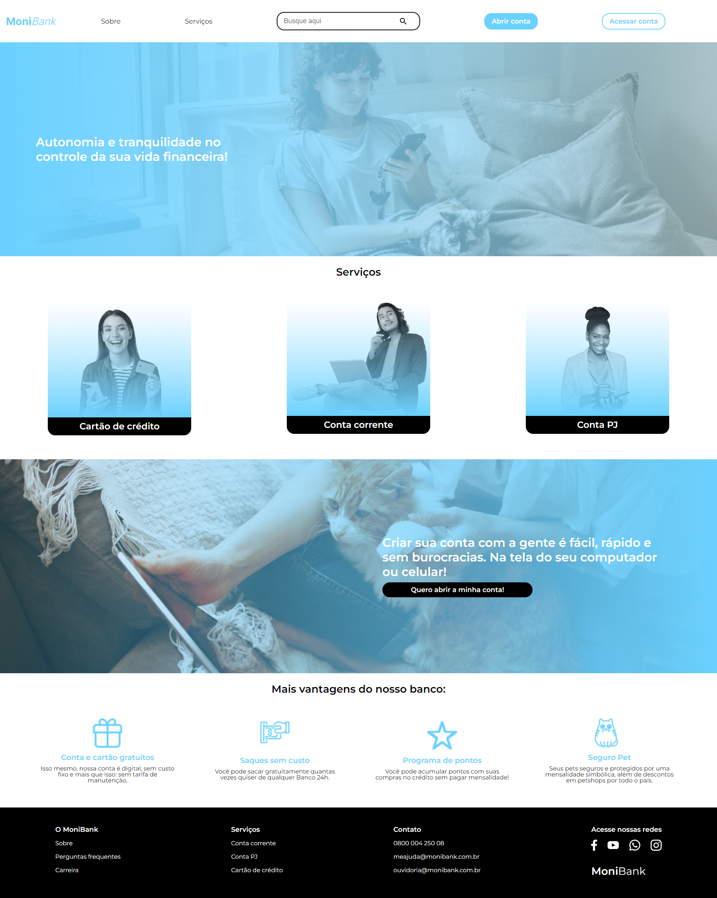
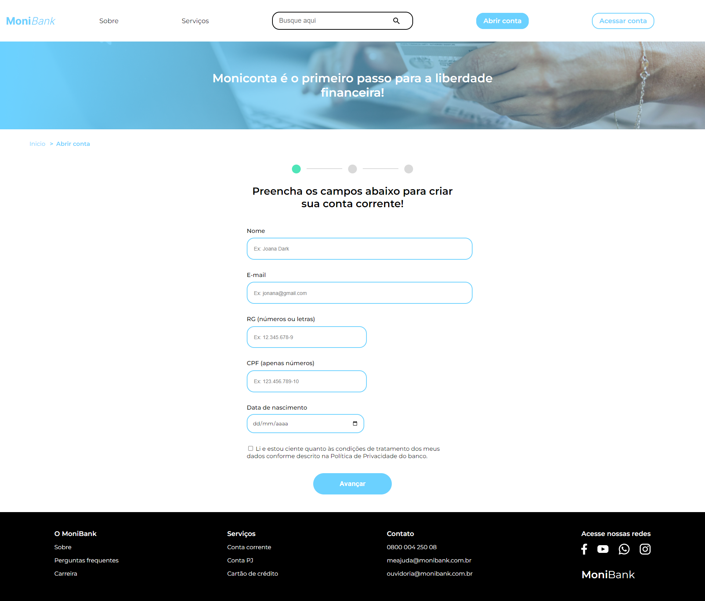
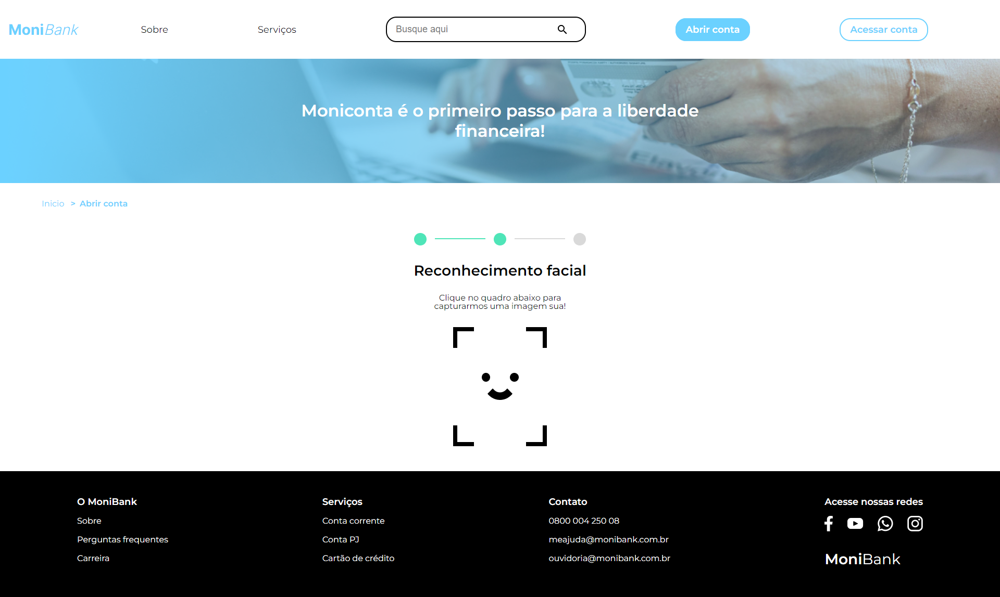

  

Formulário de criação de contas para o banco virtual MoniBank.

## Tecnologias utilizadas durante o curso
* JavaScript

## Tecnologias utilizadas no projeto
* HTML
* CSS

## O que foi ensinado no curso 

* Saiba como aplicar atributos de validação de formulário com HTML5
* Construa validações para os dígitos verificadores do CPF
* Implemente validações de maioridade a partir da comparação de datas
* Customize mensagens de erro para cada tipo de campo do formulário
* Integre a webcam do usuário em uma tela do navegador
* Capture fotos via webcam
* Salve e edite dados salvos no navegador

## Melhoria apresentada e executada
* incrementei funcionalidade de capturar uma nova foto, caso o usuário(a) não tivesse de acordo com a foto já capturada. 

 

 

 

